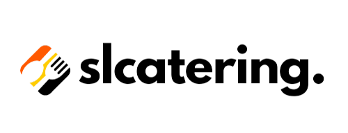

# slcatering - Catering Web Application for Internal SLC

slcatering is a web application designed to streamline catering services for the internal operations of SLC. This
project integrates modern web development practices, combining Svelte frontend with a Django backend. The system
includes user authentication, real-time order tracking using WebSockets, and has been deployed using a VPS with CI/CD
pipelines.

## Features

- User Authentication: Secure login and user management for customers and administrators.
- Menu Management: Admins can add, edit, and remove menu items, while users can browse available catering options.
- Order Placement: Users can place catering orders, customize selections, and track their status in real time.
- Payment Integration: Seamless payment processing using Duitku payment gateway.
- Real-time Updates: WebSocket integration enables live updates of order statuses for both customers and admins.
- Responsive Design: Optimized for both desktop and mobile use.

## Key Learnings
- Building dynamic user interfaces with <b>Svelte</b>
- Developing RESTful APIs with <b>Django REST Framework</b> Django
- Integrating third-party payment gateways with <b>Duitku</b>
- Utilizing <b>Django Channels</b> and WebSockets for real-time communication
- Configuring a production environment on a VPS with SSL support and automating deployment using <b>CI/CD</b> pipeline.

## Contribution

Contributed for all aspect of the project, including:

- Frontend Design and User Experience
- Frontend Development
- Backend Development
- Deployment and CI/CD

Special thanks to IC23-1 (Jessica Ryan) and ML23-1 (Michael Bryan Chandra) for the help in frontend design, backend
development, and documentation